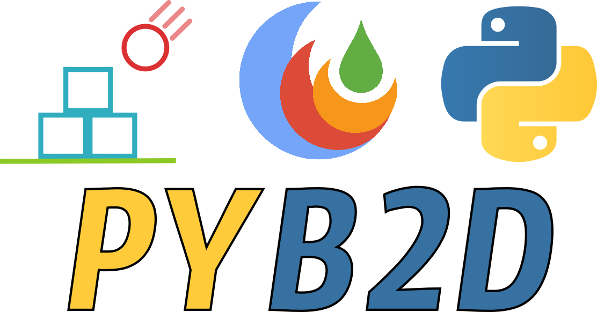

# pyb2d


[](https://github.com/pyb2d/pyb2d/actions/workflows/main.yml)
[](https://github.com/pyb2d/pyb2d/actions/workflows/pip.yml)
[](https://pyb2d.github.io/pyb2d)
[](https://mybinder.org/v2/gh/pyb2d/pyb2d/main?urlpath=/lab/tree/examples/jupyter_integration.ipynb)
[](https://anaconda.org/conda-forge/pyb2d)
[](https://anaconda.org/conda-forge/pyb2d)
[](https://anaconda.org/conda-forge/pyb2d)
[](https://anaconda.org/conda-forge/pyb2d)
[](https://conda.anaconda.org/conda-forge)

Warning, this is a work in progress and all APIs are subject to changes!
Nothing is stable yet.


## Installation

### Installing from conda-forge

One  can install `pyb2d` and its dependencies via conda:

```bash
mamba install pyb2d -c conda-forge
```
### Installing with pip

`pyb2d` can be also installed via pip (conda is recommended and should be preferred over pip)

```bash
pip install pyb2d
```

### Installing from source

`pyb2d` can also be install it from the sources but you will first need to install dependencies:

```bash
mamba install cmake python numpy pydantic -c conda-forge
```

Then you can compile the sources (replace `$CONDA_PREFIX` with a custom installation
prefix if need be)

```bash

mkdir build && cd build
cmake .. -D CMAKE_PREFIX_PATH=$CONDA_PREFIX -D CMAKE_INSTALL_PREFIX=$CONDA_PREFIX -D CMAKE_INSTALL_LIBDIR=lib
make && make install
```

## Trying it online

To try out pyb2d interactively in your web browser, just click on the binder link:

[](https://mybinder.org/v2/gh/pyb2d/pyb2d/main?urlpath=/lab/tree/examples/jupyter_integration.ipynb)


## Documentation:

The documentation can be found [here](https://pyb2d.github.io/pyb2d).
One should pay attention to the [tutorials](https://pyb2d.github.io/pyb2d/tutorials/index.html) and the [examples](https://pyb2d.github.io/pyb2d/auto_examples/index.html) section.


## Features:

* Liquidfun Integration
* Examples / Testbed for various backends:
    * pygame
    * kivy
    * jupyter (vian ipycanvas)
    * opencv (for gif-rendering only)
* Fun Examples:
The examples can be started from various backend: Here we show screenshots from the jupyter integration. These examples can be tried out online with [Binder](https://mybinder.org/v2/gh/pyb2d/pyb2d/main?urlpath=/lab/tree/examples/jupyter_integration.ipynb)


## Resources

### Jupyter Games

A medium blogpost about the jupyter integration of pyb2d. Disclaimer: The article was written @DerThorsten (the main author of pyb2d)

[](https://medium.com/p/cda20dc15a21/edit).

### pythonbytes

[Episode #264: of pythonbytes  We're just playing games with Jupyter at this point](https://pythonbytes.fm/episodes/show/264/we-re-just-playing-games-with-jupyter-at-this-point)


## History

This project originated 2015 with the goal to create python bindings for liquidfun.
The original work can still be found here: https://github.com/DerThorsten/liquidfun/tree/master/liquidfun/Box2D/pybox2d
